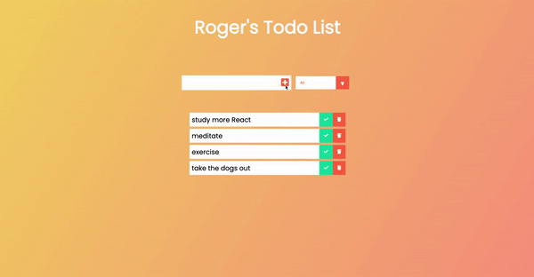

<h1>React Todo List Application</h1>
This is just a simple project to familiarize myself with React and get the hang of how it works. A todo list application is as simple as letting a user enter in ideas that they can then check off as they complete them. This application has a filter as well.
 
 

  

